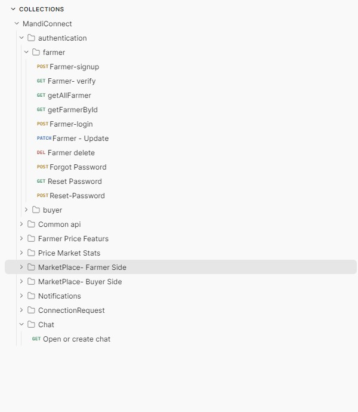
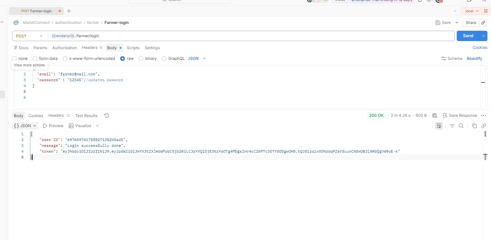
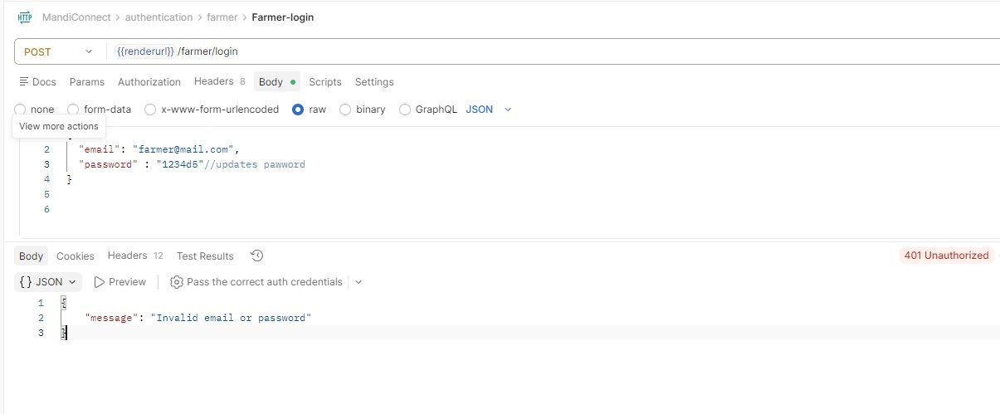
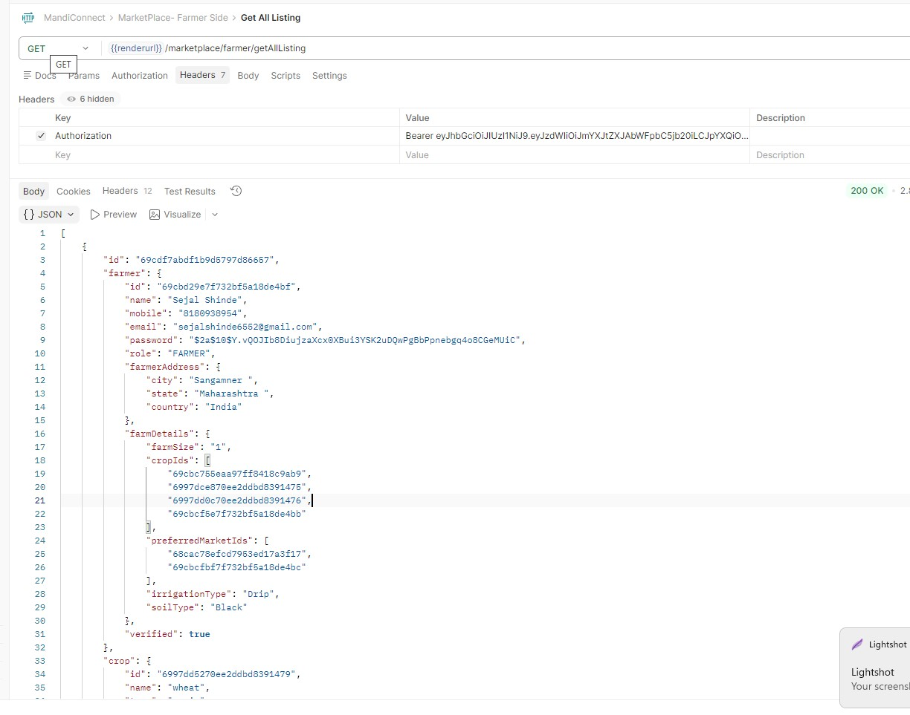

# 🌾 MandiConnect API Testing


> A hands-on API testing project for **MandiConnect** — an agricultural marketplace platform that connects farmers and buyers. This project covers complete manual API testing using Postman across all major modules including Authentication, Marketplace, Price Management, Connections, and Notifications.

---

## 📌 Overview

**MandiConnect** is a digital mandi (market) platform that enables:
- 🧑‍🌾 **Farmers** to register, list their crops, and set prices
- 🛒 **Buyers** to discover listings, post demands, and connect with farmers
- 📊 **Market Stats** to track real-time crop pricing and trends
- 🤝 **Connections** to facilitate direct farmer-buyer communication

This project focuses entirely on **manual API testing** — validating endpoints, verifying response data, testing authentication flows, and identifying edge cases across all modules.

---

## 🛠️ Tools & Technologies

| Tool | Purpose |
|------|---------|
| 🟠 **Postman** | API testing, collection management, environment variables |
| 🌐 **REST API** | Architecture style of all tested APIs |
| 📄 **JSON** | Request body and response data format |
| 🔐 **JWT (Bearer Token)** | Authentication mechanism tested across all protected routes |
| 🖥️ **Render (Cloud)** | Deployed backend server used for testing |
| 💻 **Localhost:8080** | Local backend server used during development testing |

---

## 📂 Postman Collection — Folder Structure

The collection is organized into **9 modules**, mirroring the backend feature structure:

```
📁 MandiConnect (Postman Collection)
│
├── 📂 authentication
│   ├── 📂 farmer
│   │   ├── POST   Farmer-signup
│   │   ├── GET    Farmer-verify
│   │   ├── GET    getAllFarmer
│   │   ├── GET    getFarmerById
│   │   ├── POST   Farmer-login
│   │   ├── PATCH  Farmer-Update
│   │   ├── DELETE Farmer-delete
│   │   ├── POST   Forgot Password
│   │   ├── GET    Reset Password (token verify)
│   │   └── POST   Reset-Password
│   │
│   └── 📂 buyer
│       ├── POST   Buyer-SignUp
│       ├── POST   Buyer-Login
│       ├── GET    getAllBuyer
│       ├── GET    getBuyerByID
│       ├── GET    Buyer-Verification
│       ├── PATCH  Buyer-Update
│       ├── DELETE Buyer-delete
│       ├── POST   Forget Password
│       ├── GET    Reset password (token verify)
│       └── POST   Reset-Password
│
├── 📂 Common api
│   ├── POST   Add Market
│   ├── GET    Get All Markets
│   ├── POST   Add Crop
│   └── GET    Get All Crops
│
├── 📂 Farmer Price Features
│   ├── POST   Add Farmer Price Entry
│   ├── GET    Get All Price Entries
│   ├── GET    Get Price Entries by Crop & Market
│   ├── GET    Get Price Entry by Farmer ID
│   ├── POST   Price-Agree
│   ├── POST   Price-Disagree
│   ├── GET    Get Agree Count
│   └── GET    Get Disagree Count
│
├── 📂 Price Market Stats
│   ├── GET    Get Stats by Crop ID & Market ID
│   ├── GET    Get Stats by Market
│   └── GET    Get Stats by Crop
│
├── 📂 MarketPlace — Farmer Side
│   ├── POST   Upload File (Crop Image)
│   ├── DELETE Delete File
│   ├── POST   Crop Listing
│   └── GET    Get All Listings
│
├── 📂 MarketPlace — Buyer Side
│   ├── POST   Buyer Add Demand
│   ├── GET    Buyer Get All Demands
│   ├── PATCH  Buyer Update Demand Status
│   ├── GET    Demands by Buyer ID
│   ├── DELETE Buyer Delete Demand
│   └── GET    Demands by Status (active / fulfilled / cancelled)
│
├── 📂 Notifications
│   └── GET    Get Notifications by User ID
│
├── 📂 ConnectionRequest
│   ├── GET    Get All Incoming Connection Requests
│   ├── POST   Create Connection Request
│   ├── POST   Accept Connection Request
│   ├── POST   Reject Connection Request
│   ├── GET    Get My Sent Requests
│   └── GET    Check Connection Status
│
└── 📂 Chat
    └── GET    Open or Create Chat
```

---

## 🔌 APIs Tested

### 🔐 Authentication — Farmer

| Method | Endpoint | Description |
|--------|----------|-------------|
| `POST` | `/farmer/signup` | Register a new farmer with farm details |
| `GET` | `/farmer/verify?token=` | Verify email via token |
| `POST` | `/farmer/login` | Farmer login — returns JWT token |
| `GET` | `/farmer/getFarmers` | Get all registered farmers |
| `GET` | `/farmer/{id}` | Get farmer by ID |
| `PATCH` | `/farmer/update/{id}` | Update farmer profile (Auth required) |
| `DELETE` | `/farmer/delete/{id}` | Delete farmer account (Auth required) |
| `POST` | `/farmer/forgot-password` | Trigger forgot password email |
| `POST` | `/farmer/reset-password?token=` | Reset password with token |

### 🔐 Authentication — Buyer

| Method | Endpoint | Description |
|--------|----------|-------------|
| `POST` | `/buyer/signup` | Register a new buyer with company details |
| `GET` | `/buyer/verify?token=` | Verify buyer email |
| `POST` | `/buyer/login` | Buyer login — returns JWT token |
| `GET` | `/buyer/getAll` | Get all buyers |
| `GET` | `/buyer/{id}` | Get buyer by ID |
| `PATCH` | `/buyer/update/{id}` | Update buyer profile (Auth required) |
| `DELETE` | `/buyer/delete/{id}` | Delete buyer account (Auth required) |
| `POST` | `/buyer/forgot-password` | Trigger forgot password email |
| `POST` | `/buyer/reset-password?token=` | Reset password with token |

### 🌾 Common APIs

| Method | Endpoint | Description |
|--------|----------|-------------|
| `POST` | `/addMarket` | Add a new mandi/market |
| `GET` | `/getAllMarket` | Get list of all markets |
| `POST` | `/addCrop` | Add a new crop (grain, fruit, vegetable) |
| `GET` | `/getAllCrop` | Get list of all crops |

### 💰 Farmer Price Features

| Method | Endpoint | Description |
|--------|----------|-------------|
| `POST` | `/farmer-entries/add` | Add a price entry for a crop at a market |
| `GET` | `/farmer-entries/getAllEntries` | Fetch all price entries |
| `GET` | `/farmer-entries/getByCropAndMarket/{cropId}/{marketId}` | Filter by crop and market |
| `GET` | `/farmer-entries/getByFarmerId/{farmerId}` | Get entries by farmer |
| `POST` | `/farmer-entries/agree/{entryId}/{farmerId}` | Vote agree on a price |
| `POST` | `/farmer-entries/disagree/{entryId}/{farmerId}` | Vote disagree on a price |
| `GET` | `/farmer-entries/agree-count/{entryId}` | Get total agree votes |
| `GET` | `/farmer-entries/disagree-count/{entryId}` | Get total disagree votes |

### 📊 Price Market Stats

| Method | Endpoint | Description |
|--------|----------|-------------|
| `GET` | `/stats/getByCropIdAndMarketid/{cropId}/{marketId}` | Price stats by crop & market |
| `GET` | `/stats/getByMarket/{marketId}` | All price stats for a market |
| `GET` | `/stats/getByCrop/{cropId}` | All price stats for a crop |

### 🛒 MarketPlace — Farmer Side

| Method | Endpoint | Description |
|--------|----------|-------------|
| `POST` | `/marketplace/farmer/upload` | Upload crop image (multipart/form-data) |
| `DELETE` | `/marketplace/farmer/delete?public_id=` | Delete crop image from Cloudinary |
| `POST` | `/marketplace/farmer/cropListing` | Create a new crop listing |
| `GET` | `/marketplace/farmer/getAllListing` | Get all active crop listings |

### 🛍️ MarketPlace — Buyer Side

| Method | Endpoint | Description |
|--------|----------|-------------|
| `POST` | `/marketplace/buyer/add` | Buyer posts a crop demand |
| `GET` | `/marketplace/buyer/all` | Get all buyer demands |
| `PATCH` | `/marketplace/buyer/updateStatus/{id}` | Update demand status (active/fulfilled/cancelled) |
| `GET` | `/marketplace/buyer/buyer/{buyerId}` | Get demands by buyer ID |
| `DELETE` | `/marketplace/buyer/delete/{id}` | Delete a demand |
| `GET` | `/marketplace/buyer/status/active` | Filter demands by status |

### 🔔 Notifications

| Method | Endpoint | Description |
|--------|----------|-------------|
| `GET` | `/notifications/user/{userId}` | Get all notifications for a user |

### 🤝 Connection Requests

| Method | Endpoint | Description |
|--------|----------|-------------|
| `POST` | `/connections/send` | Send a connection request (Buyer → Farmer or Farmer → Buyer) |
| `GET` | `/connections/incoming/{userId}` | View all incoming connection requests |
| `POST` | `/connections/accept/{requestId}` | Accept a connection request |
| `POST` | `/connections/reject/{requestId}` | Reject a connection request |
| `GET` | `/connections/sent/{userId}` | View all sent connection requests |
| `GET` | `/connections/status?senderId=&receiverId=` | Check connection status between two users |

---

## 🧪 Testing Scenarios

### ✅ Positive Test Cases
- Farmer registers successfully with all required fields → `201 Created`
- Farmer logs in with correct credentials → returns valid JWT token
- Buyer posts a demand with valid crop ID, quantity, and price
- Farmer adds a price entry for a crop at a market → `200 OK`
- Buyer sends connection request to farmer → request saved as PENDING
- Farmer accepts connection request → status updated to ACCEPTED
- Get all listings returns active records with correct response structure

### ❌ Negative Test Cases
- Login with wrong password → `401 Unauthorized`
- Signup with duplicate email → proper error message returned
- Access protected route without token → `403 Forbidden`
- Pass invalid/expired JWT token → `401 Unauthorized`
- Create listing with missing required fields → `400 Bad Request`
- Fetch farmer by invalid ID → `404 Not Found`
- Reject connection request that doesn't exist → proper error returned

### ⚠️ Edge Cases
- Empty string in required fields (name, email, password)
- Invalid email format during signup
- Negative price value in crop listing
- Demand status set to an invalid value (not active/fulfilled/cancelled)
- Sending duplicate connection request to same user
- Reset password with an already-used or expired token
- Uploading a file with unsupported format

---

## ✔️ Validations Performed

- 🔢 **Status Code Validation** — Verified correct HTTP codes (200, 201, 400, 401, 403, 404)
- 📦 **Response Body Validation** — Checked all response fields, types, and expected values
- 🔐 **JWT Authentication** — Verified Bearer token is required for all protected endpoints
- 🔁 **Full CRUD Validation** — Tested Create, Read, Update, Delete across all modules
- 📋 **Schema Validation** — Confirmed JSON response structure matches expected format
- ⏱️ **Response Time Check** — Verified APIs respond in acceptable time on Render server
- 🚫 **Error Message Validation** — Confirmed meaningful error messages on invalid input
- 🔗 **Connection Flow Validation** — Tested complete send → accept/reject connection flow end-to-end
- 💰 **Price Voting Validation** — Verified agree/disagree counts update correctly

---

## 📸 Screenshots


> 📁 All screenshots are stored in the `/screenshots` folder of this repository.









---

## 📁 Project Structure

```
MandiConnect-API-Testing/
│
├── 📂 postman/
│   ├── MandiConnect_Collection.json          # Exported Postman collection
│
├── 📂 screenshots/
│   ├── farmer_login_success.png
│   ├── farmer_login_failed.png
│   ├── get_all_listings.png
│   ├── crop_listing_create.png
│   ├── add_price_entry.png
│   ├── send_connection_request.png
│   ├── accept_connection.png
│   └── unauthorized_403.png
│
└── 📄 README.md                              # Project documentation
```

---

## 🔗 Postman Collection

You can directly access the live Postman collection here:

[](https://go.postman.co/collection/38511836-07f08056-1f43-4c96-89e4-a9f2c18fec30?source=collection_link)

> 📥 **To import manually into Postman:**
> 1. Open Postman → Click **Import**
> 2. Select `postman/MandiConnect_Collection.json`
> 3. Import `MandiConnect_Environment.json` for environment variables
> 4. Set `renderurl` = `https://mandiconnect.onrender.com` in the environment
> 5. Run individual requests or use **Collection Runner** for full flow testing

---

## 💡 Key Learnings

Through this project, I gained hands-on experience in:

- 🧠 Understanding REST API architecture (request, response, headers, body, status codes)
- 🔐 Testing JWT-based authentication — how Bearer tokens protect API routes
- 🌐 Difference between local (localhost:8080) and deployed (Render) server testing
- 🧪 Writing structured positive, negative, and edge case test scenarios
- 🛠️ Using Postman features — Collections, Environment Variables, Authorization headers
- 🗂️ Organizing API tests into folders by feature module
- 📋 Documenting bugs clearly with steps to reproduce and expected vs actual results
- ☁️ Understanding file upload APIs using multipart/form-data with Cloudinary integration
- 🤝 Testing multi-step workflows (e.g., send → accept/reject connection flow end-to-end)

---

## 👤 Author

**Yogesh Shinde**

[](https://www.linkedin.com/in/Y0GESHSHINDE/)
[](https://github.com/Y0GESHSHINDE/)
[](mailto:work.yogeshshinde@gmail.com)

---

<div align="center">

⭐ If you found this project helpful, consider giving it a **star**!

*Made with ❤️ for learning and growth in Software Testing*

</div>
